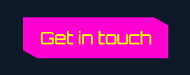

# Damon The Dev Portfolio Site

## Description

The Damon The Dev site was built to showcase my work as a software developer. It was designed in Figma and built with React.

[Live Site](https://damon-the-dev.vercel.app/)

## Demo


## Technologies Used

* React
* CSS

## Features
### Intuitive user-interface
The Projects component features a list of menu items for projects based on the `projects` array. Each menu item represents a project and displays its title. When a menu item is clicked, it triggers the `handleMenuItemClick` function, which updates the selected project by setting the `selectedMenuItem` state. The selected menu item's triangle shaped bullet point will be colored in due to the "selected" class applied conditionally. This way, users can easily see which project is currently displayed in the Projects component and navigate between different projects.
```js
<ul className="projects-ul">
    {projects.map((p, i) => {
        return (
            <li
            className={selectedMenuItem === p.id ? "selected" : ""}
            onClick={() => handleMenuItemClick(p.id)}
            >
            {p.title}
            </li>
        );
     })}
</ul>
```
The content pertaining to the selected project is displayed in the `projects-main` div. The project index number represented by the `selectedMenuItem` state is used to retrieve content from the `projectsContent.js` file. Since some of my projects were built with site builders, conditional rendering is used to determine whether a 'View Code' or 'View Site' button is needed.

```js
<h2>{projects[selectedMenuItem].title}</h2>
{projects[selectedMenuItem].description.map((p, index) => (
    <p key={index}>{p}</p>
))}
;
{projects[selectedMenuItem].stack === "" ? null : (
    <p><span className="stack">Stack</span>: <span className="tech">{projects[selectedMenuItem].stack}</span></p>
)}
{projects[selectedMenuItem].code === "" ? null : (
    <a
    href={projects[selectedMenuItem].code}
    target="_blank"
    rel="noreferrer"
    >
    <button className="clipped view">View Code</button>
    </a>
)}
{projects[selectedMenuItem].site === "" ? null : (
    <a
    href={projects[selectedMenuItem].site}
    target="_blank"
    rel="noreferrer"
    >
    <button className="clipped view">View Site</button>
    </a>
)}
```

### Partial borders for minimalist framing
Partial borders are used throughout the site to create an elegant, minimalist sci-fi look. I achieved this look by creating `before` and `after` pseudo-elements and positioning them absolutely. These elements are then targeted individually to have the necessary borders displayed (eg `border-left/border-top`)
```css
.main-content {
  position: relative;
  padding: 1.5rem;
  text-align: center;
  max-width: 1200px;
  margin: 3rem auto;
}

.main-content::before,
.main-content::after {
  position: absolute;
  width: 10rem;
  height: 10rem;
  content: "";
}

.main-content::before {
  left: 0;
  top: 0;
  border-left: 3px solid #04fdff;
  border-top: 3px solid #04fdff;
}

.main-content::after {
  right: 0;
  bottom: 0;
  border-right: 3px solid #04fdff;
  border-bottom: 3px solid #04fdff;
}
```
### Clipped buttons for cool, sci-fi look
The buttons have clipped corners to achieve a sci-fi look. This is achieved by using the `clip-path` property in CSS. I created the CSS class `clipped` and applied the following property: `clip-path: polygon(0 0, 90% 0, 100% 20%, 100% 100%, 10% 100%, 0 80%);`



## License

MIT

## Contact/Social

* [Linkedin](https://www.linkedin.com/in/damon-pickett/)
* [twitter](https://twitter.com/home)
* [Email](https://damon-the-dev.vercel.app/) - Go to my site, click 'Get in Touch' button, and use contact form :)
